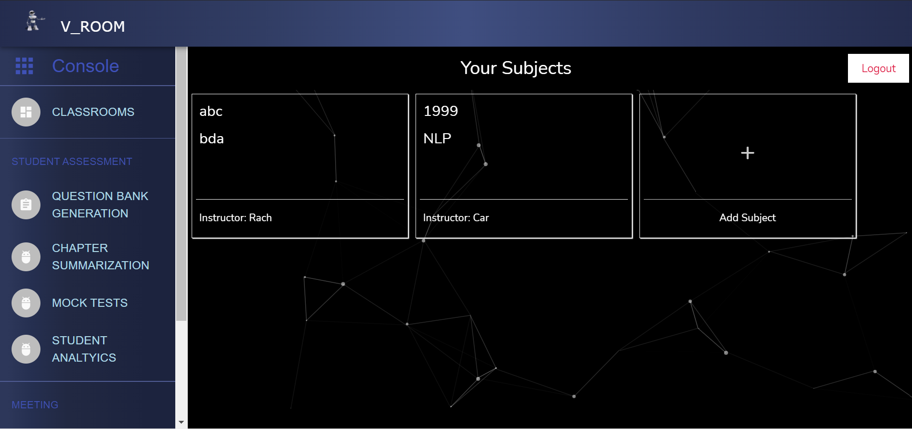

# V_ROOM (VIRTUAL CLASSROOM)
A WebApp similar to Google Classroom. And Creating A Community Of Life-Long Learners....Learning Today . . . Leading Tomorrow.

### Description

A website/app to simplify learning and provide maximal convenience so that students can continue to focus on their Education. Enable common classroom features to make the app/website robust. Allow Teachers to create groups based on any emergent criteria. After all , if Education is a fundamental right of every child, Education needs to be fundamentally right for every child.

Allow teachers to create and students to submit Assignments and Quizzes to supplement the classroom. Notify students when tasks are assigned , submissions are due or tests are graded.

Enable Topic wise filtering to help students focus on the concepts they find challenging. Generate Analytics and reports for classroom performance to help teachers estimate concepts that are not fully grasped by a significant number of students. 
Enable Real-time lectures for virtual education allowing educators and learners to interact, perform a quick check-in and review direction and facilitate recording attendance.																							

And Many More….

------------------------------------------------------------------

## Tech Stack
- React JS
- Node JS
- Particle JS
- Pytorch
- Firebase

------------------------------------------------------------------

## Additional Features

- Creation of Instant Meeting and Attendance	

The Web - Application allows the teacher to instantly create a Meeting at a given time and send the link across to all the students who have joined the particular course.

The Teacher can also download for herself an Attendance update after every lecture which consist of the Student’s Present-Absent Activity during the lecture.

- Assisting Weaker Students with Summary Notes

With our Machine Learning Based Model created, the weaker student can have for himself a machine response for every question he poses in regards to the subject at all times.
This response is based on the notes uploaded by the teacher, scanned and processed the system.

This can also help the teachers to create question papers or test materials with utmost ease.

- Assignment Checker

The Assignment to be submitted can be uploaded by the teacher and this has a given date and time for submission.

The systems helps the students to keep track of his/her assignments due and helps them upload files from their system.

The system keeps a track of the due date and notifies the teacher of all the students who have not submitted the Assignment at the given date and time.

------------------------------------------------------------------

## Working of the Project

- Youtube: https://youtu.be/NJmeQ7gVKNs
- PPT: https://github.com/carol80/LOC3.0_PHOSPHENES/blob/main/Screenshots/Vroom.pdf
- ScreenShot(s): 
